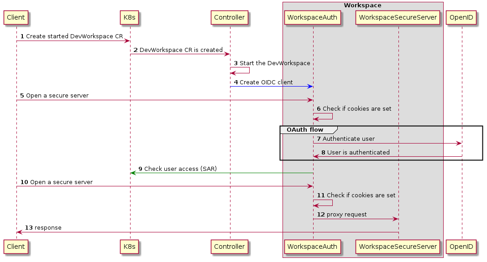

This documents describes the alternatives which could be implemented for DevWorkspace endpoints authentication

# Che Workspaces Servers Authentication

Che Workspace Servers supports SSO(Single Sign-One) which means - user authenticate once on the main host and then user is automatically authenticated on workspaces hosts with loader.html + Che JWT proxy which do the SSO magic.

# DevWorkspaces Servers Authentication with JWTProxy + "AuthBridge" for SSO

It's the mainly the same schema as Che Workspaces have difference here that DevWorkspace Operator should deploy additional component "AuthBridge" which will authorize requests and provide SSO.

Cons:
- everybody who is able to read DevWorkspace CR (or DevWorkspaceRouting CR) where jwtproxy is stoted - is able to access workspace, which mean we don't provide creator access only;

# DevWorkspaces Servers Authentication with OpenID

Pros:
- no additional component is required;

Cons:
- probably different clients should be registered on OpenID provider side with workspaces specific endpoints;
- users should authenticate separately for each workspace. User will be asked if they rely that particular domain;

  \* we should be able to run everything on one host, and SSO could be implemented but that's not safe to do without additional authorization since OpenID token will be sent to workspace which may be fake just to steal token.

# TODO:
- Show more clearly on the diagram at which point OpenID provider is configured to be able to work with specific OpenID client;
- Think more about Single Host mode, where AuthBridge and Workspaces live on the same cluster. Can it helps use to provide SSO with creator access only?
